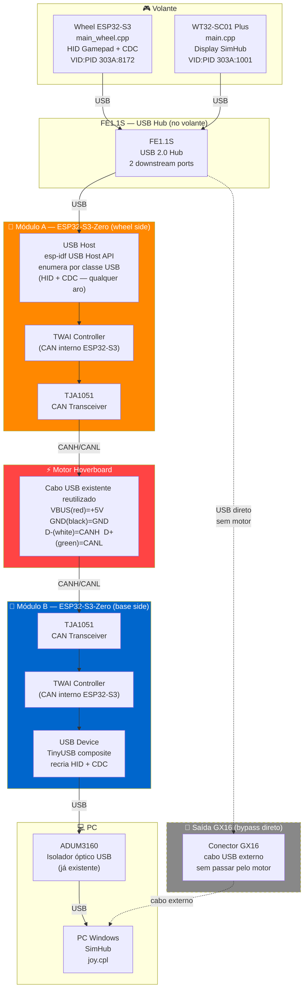
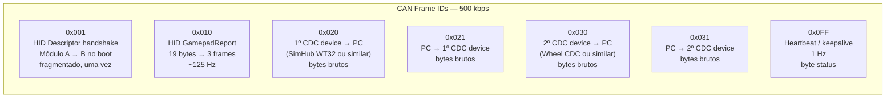
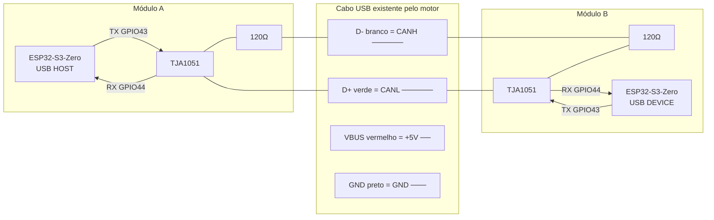
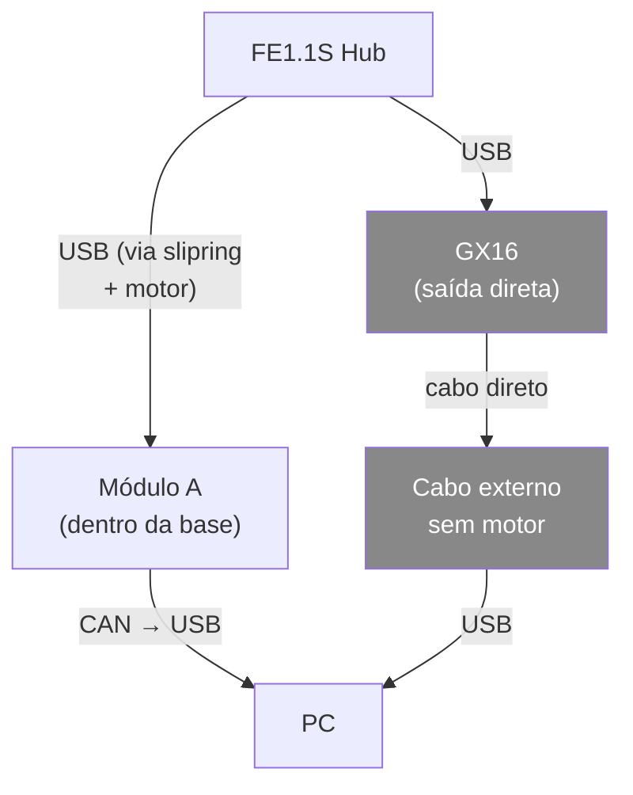

# CAN-USB Bridge — Isolação EMI para Motor Hoverboard

## Problema

O cabo USB passando pelo interior do motor hoverboard (direct drive) sofre indução eletromagnética diferencial, derrubando a conexão USB mesmo com blindagem e ferrite.

O ADUM3160 posicionado **após** o motor não resolve: o ruído é induzido **antes** de chegar ao isolador.

---

## Solução: CAN bus no trecho problemático

Substituir o USB pelo par trançado CANH/CANL (CAN bus) no único trecho crítico — dentro do motor. O CAN opera com sinalização diferencial de ±5V e rejeição de modo comum de ±25V, sendo o protocolo padrão de barramentos automotivos com motores ligados.

Dois módulos ESP32-S3-Zero fazem a conversão USB↔CAN de forma transparente. O firmware do volante e do WT32 **não muda nada**.

---

## Arquitetura Geral



---

## Fluxo de Dados CAN



**Largura de banda estimada:**

| Stream | Taxa | Bytes/s | % de 500kbps |
|---|---|---|---|
| HID Gamepad (19B @ 125Hz) | 125 Hz | 2.375 kB/s | 3.8% |
| WT32 CDC bidirecional | ~100 B/s | 200 B/s | 0.03% |
| Wheel CDC bidirecional | ~2 kB/s | 4 kB/s | 0.6% |
| Heartbeat | 1 Hz | 1 B/s | <0.01% |
| **Total** | — | **~6.5 kB/s** | **~10%** |

Margem de 90% — muito confortável.

---

## Pinagem — ESP32-S3-Zero

### Módulo A (Wheel Side — USB Host)

| GPIO | Função | Descrição |
|---|---|---|
| 19 | USB_D- | D- do FE1.1S (USB Host via OTG) |
| 20 | USB_D+ | D+ do FE1.1S (USB Host via OTG) |
| 43 | TWAI_TX | → TJA1051 TXD |
| 44 | TWAI_RX | ← TJA1051 RXD |
| 3V3 | VCC | TJA1051 VCC (3.3V) |
| GND | GND | GND comum |

> **Nota:** ESP32-S3-Zero usa USB nativo no GPIO19/20 para device mode por padrão. Para host mode, o pino VBUS precisa de 5V via MOSFET externo ou jumper para alimentar o FE1.1S.

### Módulo B (Base Side — USB Device)

| GPIO | Função | Descrição |
|---|---|---|
| 19 | USB_D- | D- para ADUM3160 (USB Device) |
| 20 | USB_D+ | D+ para ADUM3160 (USB Device) |
| 43 | TWAI_TX | → TJA1051 TXD |
| 44 | TWAI_RX | ← TJA1051 RXD |
| 3V3 | VCC | TJA1051 VCC |
| GND | GND | GND comum |

### TJA1051 (ambos os módulos)

| Pino TJA1051 | Conexão |
|---|---|
| TXD | ESP32-S3 TWAI_TX |
| RXD | ESP32-S3 TWAI_RX |
| VCC | 3.3V |
| GND | GND |
| CANH | Par trançado (fio 1) |
| CANL | Par trançado (fio 2) |
| S (Silent) | GND (modo normal) |

> **Resistor de terminação:** 120Ω entre CANH e CANL em **cada extremidade** (dentro do motor = sem terminação, nas pontas = com terminação).

---

## Reutilização do Cabo USB Existente

O cabo USB que já passa pelo interior do motor pode ser reutilizado diretamente — os 4 fios recebem novas funções:

| Fio USB | Cor padrão | Nova função | Destino |
|---|---|---|---|
| VBUS | Vermelho | +5V alimentação | Módulo A e Módulo B (via regulador interno) |
| D- | Branco | CANH | TJA1051 CANH |
| D+ | Verde | CANL | TJA1051 CANL |
| GND | Preto | GND | GND comum |

**Vantagens:**
- D- e D+ já são par trançado dentro do cabo USB — exatamente o necessário para CAN diferencial
- VBUS fornece 5V para alimentar ambos os módulos ESP32-S3-Zero sem fio adicional
- Zero modificação mecânica — usa o mesmo furo/passagem já existente no motor

**Nota sobre impedância:** Cabo USB usa 90Ω diferencial, CAN especifica 120Ω. Para ~0.5m não há impacto prático — a diferença de impedância só afeta CAN em cabos longos (>10m) a alta velocidade.

**Resistência medida dos fios:** ~0.9Ω por fio (medição: 3.0Ω com fio, 2.1Ω pontas do multímetro sem nada → resistência líquida = 0.9Ω).

| Fio | Função CAN | Impacto no sinal |
|---|---|---|
| D- (CANH) | Sinal diferencial | 33mA × 0.9Ω = **30mV** de queda — 1,5% do sinal de 2V → desprezível |
| D+ (CANL) | Sinal diferencial | idem — perda diferencial total ≈ 60mV vs. 2000mV → OK |
| VBUS (+5V) | Alimentação Módulo A | ver tabela abaixo |
| GND | Retorno alimentação | 0.9Ω em série com VBUS |

**Queda de tensão na alimentação (loop VBUS+GND = 1.8Ω):**

| Corrente Módulo A | Queda | Tensão no módulo | Situação |
|---|---|---|---|
| 200 mA (ESP32 + TJA, sem hub) | 360 mV | 4.64 V | ✅ OK |
| 350 mA (ESP32 + TJA + FE1.1S) | 630 mV | 4.37 V | ✅ OK |
| 500 mA (máx hub USB 2.0) | 900 mV | 4.10 V | ⚠️ Limite |

> **Recomendação:** medir a corrente real na bancada. Se ultrapassar 350mA, alimentar o Módulo A diretamente do barramento 5V do volante (que já tem fonte própria) em vez de usar o VBUS do cabo pelo motor.

---

## Diagrama Elétrico Simplificado



---

## Estrutura do Firmware

### Módulo A — `can_bridge_wheel_side`

```
src/
  main.cpp          — setup/loop principal
  usb_host.cpp      — enumera hub, detecta devices por bInterfaceClass
  can_tx.cpp        — serializa e transmite frames CAN
  can_rx.cpp        — recebe frames CDC do PC e repassa aos devices via USB
```

**Comportamento:**
1. Boot: inicializa USB Host, aguarda hub enumerar
2. Detecta devices **por classe USB**, não por VID:PID:
   - `bInterfaceClass == 0x03` (HID) → device de gamepad, qualquer aro
   - `bInterfaceClass == 0x02 / 0x0A` (CDC ACM) → 1º encontrado = stream `0x020/0x021`, 2º = `0x030/0x031`
3. Lê HID Report Descriptor do device HID → fragmenta e envia via CAN `0x001` para Módulo B
4. Aguarda ACK do Módulo B (`0x001` com flag `ACK`) antes de iniciar loop
5. Loop: lê HID reports → CAN `0x010-0x012`
6. Loop: pipe bidirecional de cada CDC device para os CAN IDs correspondentes
7. Heartbeat CAN `0x0FF` a cada 1s

> **Troca de aro:** ao reconectar o USB do hub, Módulo A re-enumera, envia o novo descriptor via `0x001`, Módulo B reconecta ao PC com o novo descriptor. Zero recompilação.

### Módulo B — `can_bridge_base_side`

```
src/
  main.cpp          — setup/loop principal
  can_rx.cpp        — recebe frames CAN, monta buffers por stream
  can_tx.cpp        — transmite CDC do PC para o CAN
  usb_device.cpp    — TinyUSB composite: HID dinâmico + 2x CDC
```

**Comportamento:**
1. Boot: aguarda CAN `0x001` com HID Report Descriptor do Módulo A
2. Recebe descriptor fragmentado, monta buffer completo, envia ACK
3. Inicializa TinyUSB composite dinamicamente: HID com o descriptor recebido + 2 interfaces CDC
4. Apresenta ao PC como device genérico — VID/PID configurável via `#define` no firmware
5. Loop: recebe CAN `0x010-0x012` → monta `GamepadReport` → envia HID report USB
6. Loop: recebe CAN `0x020` → pipe bytes CDC1 ao PC; recebe CDC1 do PC → CAN `0x021`
7. Loop: recebe CAN `0x030` → pipe bytes CDC2 ao PC; recebe CDC2 do PC → CAN `0x031`
8. Monitora heartbeat — se CAN silencioso >2s, zera botões no HID report
9. Se Módulo A reenvia `0x001` (troca de aro) → deinicializa TinyUSB, reinicia do passo 2

---

## HID Descriptor — Negociação Dinâmica

O Módulo B **não hardcoda** o descriptor. O Módulo A lê o descriptor diretamente do device HID conectado via `GET_DESCRIPTOR(HID_REPORT)` e transmite pelo CAN `0x001`.

**Aro atual (`main_wheel.cpp`) como referência:**
- Report ID: `HID_REPORT_ID_GAMEPAD` (= 3)
- 64 botões (8 bytes)
- 1 HAT switch 4-bit + 4-bit padding (1 byte)
- 10 eixos int8 (10 bytes)
- **Total report: 19 bytes** (sem contar Report ID)

**Qualquer aro futuro** com descriptor diferente funciona automaticamente — Módulo A descobre, Módulo B replica, PC vê o novo HID sem driver change.

---

## Protocolo CAN — Formato dos Frames

### HID Descriptor Handshake (boot, uma vez por conexão)

```
Frame 0x001: [flags] [offset_hi] [offset_lo] [len] [byte0..3]   (4 bytes de dados por frame)
  flags: 0x00 = fragmento, 0x80 = último fragmento, 0x81 = ACK (Módulo B → A)
  offset: posição no buffer do descriptor
```

Descriptor máximo: 256 bytes (típico HID gamepad: ~50-80 bytes). Transferência completa em ~20 frames CAN, < 5ms a 500kbps.

### HID GamepadReport (19 bytes aro atual → 3 frames CAN)

```
Frame 0x010: [seq] [btn0..6]          (7 bytes buttons)
Frame 0x011: [seq] [btn7] [hat] [x] [y] [z] [rx] [ry]
Frame 0x012: [seq] [rz] [slider] [dial] [vx] [vy] [0x00]
```

`seq` = contador 0-255. Se o aro futuro tiver report diferente, os frames são redimensionados automaticamente — Módulo A conhece o report size após enumerar.

> **Nota:** O formato 0x010-0x012 é fixo em 3 frames de 8 bytes para simplificar o Módulo B. Reports maiores que 22 bytes usariam 4+ frames (adicionar `0x013`, etc.). Reports menores são padded com `0x00`.

### CDC Bytes (WT32 e Wheel)

```
Frame 0x020/0x030: [len] [byte0..6]   (até 7 bytes de dados CDC)
Frame 0x021/0x031: [len] [byte0..6]   (PC → device)
```

### Heartbeat

```
Frame 0x0FF: [status_A]   (Módulo A envia)
             [status_B]   (Módulo B envia)
status: 0x01=ok, 0x02=host_error, 0x03=no_devices, 0x04=descriptor_pending
```

---

## GX16 — Saída Direta (bypass)

O conector GX16 no volante conecta **direto ao FE1.1S**, antes do Módulo A. Quando usado com cabo externo (sem passar pelo motor), o fluxo é USB puro sem intermediários — compatível com a configuração atual.



---

## Lista de Materiais

| Item | Qtd | Obs |
|---|---|---|
| ESP32-S3-Zero | 2 | já disponível |
| TJA1051T/3 | 2 | já disponível |
| Resistor 120Ω 1/4W | 2 | terminação CAN |
| ~~Par trançado 24AWG~~ | ~~0.5m~~ | **reutilizar cabo USB existente** |
| Conector 4 vias (VBUS/D-/D+/GND) | 2 | reconectar nas extremidades |

**Custo adicional:** R$0 (hardware já disponível, cabo USB reutilizado)

---

## Próximos Passos

1. [ ] Firmware Módulo A — USB Host + CAN TX
2. [ ] Firmware Módulo B — CAN RX + USB Device (HID + CDC)
3. [ ] Teste bancada sem motor (verificar latência HID)
4. [ ] Teste com motor ligado
5. [ ] Integrar na estrutura da base
