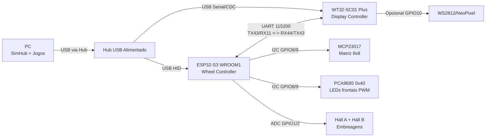
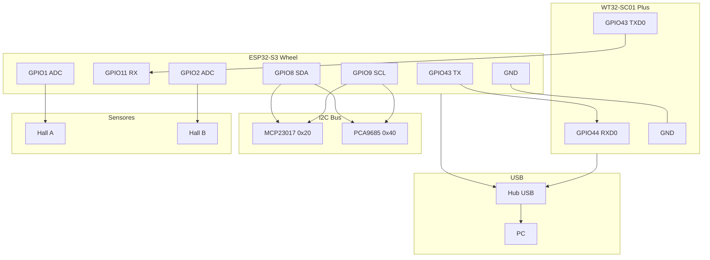
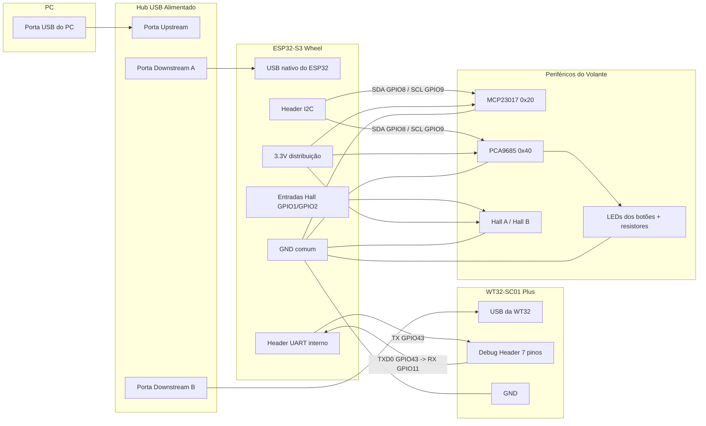
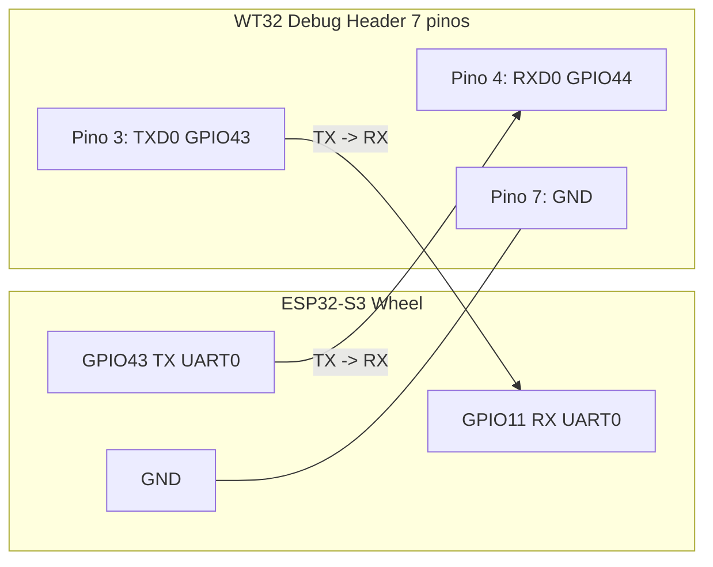

# Esquema Elétrico Completo — Volante SimRacing (ESP32-S3 + WT32 + USB Hub)

Este documento descreve, de forma didática, como o seu volante foi montado eletricamente para que qualquer pessoa consiga entender a arquitetura e reproduzir o projeto.

## 1) Visão Geral da Arquitetura

O sistema é dividido em 2 firmwares/placas principais:

- **ESP32-S3 WROOM1 (Wheel Controller)**
  - Lê botões, encoders e sensores Hall
  - Controla LEDs frontais via PCA9685
  - Expõe **USB HID Gamepad + Consumer Control** para o PC
  - Envia eventos/menu para a tela via UART

- **WT32-SC01 Plus (Display Controller)**
  - Recebe telemetria do SimHub via USB serial
  - Renderiza dashboard na tela TFT
  - Recebe mensagens do volante via UART (popup/menu)
  - Opcional: controla fita WS2812 por GPIO10 (EXT_IO1)

## 2) Diagrama de Blocos (Sistema Completo)

```text
                              ┌───────────────────────────┐
                              │            PC             │
                              │    SimHub + Jogos + OS    │
                              └─────────────┬─────────────┘
                                            │
                                  USB (via HUB USB)
                                            │
                     ┌──────────────────────┴──────────────────────┐
                     │                                             │
        ┌────────────▼────────────┐                   ┌────────────▼────────────┐
        │ ESP32-S3 WROOM1 (Wheel) │<──── UART ───────>│ WT32-SC01 Plus (Display)│
        │ USB HID + lógica volante │   115200 8N1     │ Dashboard SimHub         │
        └───────┬─────────┬───────┘                   └────────────┬─────────────┘
                │         │                                          │
              I2C       ADC                                          │ USB serial
         (GPIO8/9)   (GPIO1/2)                                       │
                │         │                                           │
      ┌─────────▼───┐  ┌──▼────────────┐                             │
      │ MCP23017    │  │ Hall A / Hall B│                             │
      │ Matriz 8x8  │  │ Embreagens     │                             │
      └─────────────┘  └───────────────┘                             │
                │                                                     │
      ┌─────────▼──────────┐                                          │
      │ PCA9685 (0x40)     │                                          │
      │ LEDs frontais PWM  │                                          │
      └────────────────────┘                                          │
```

### 2.1 Diagrama Mermaid (Arquitetura)



### 2.2 Diagrama Mermaid (Conexões Críticas)



### 2.3 Diagrama Mermaid (Chicote e Conectores Físicos)



## 3) Ligações Principais Entre as Placas

### 3.1 UART Wheel <-> WT32 (menu/popup/diagnóstico)

Conexão cruzada (TX -> RX):

- ESP32 Wheel `GPIO43 (TX)` -> WT32 `RXD0 / GPIO44` (debug header pino 4)
- ESP32 Wheel `GPIO11 (RX)` <- WT32 `TXD0 / GPIO43` (debug header pino 3)
- `GND` comum entre as duas placas
- Baudrate: **115200, SERIAL_8N1**

### 3.1.1 Pin-to-pin literal (plug-and-play)

| Origem (Wheel ESP32-S3) | Destino (WT32 Debug Header) | Função | Observação |
|---|---|---|---|
| GPIO43 (TX UART0) | Pino 4 = RXD0 / GPIO44 | Wheel -> WT32 | Linha de dados principal |
| GPIO11 (RX UART0) | Pino 3 = TXD0 / GPIO43 | WT32 -> Wheel | Retorno/PONG/diagnóstico |
| GND | Pino 7 = GND | Referência elétrica | Obrigatório para UART estável |

Pinos do debug header WT32 usados neste projeto:

- Pino 3: TXD0 / GPIO43
- Pino 4: RXD0 / GPIO44
- Pino 7: GND

### 3.1.2 Mermaid pin-to-pin (UART literal)



### 3.2 I2C interno do volante

Barramento I2C no ESP32 Wheel:

- `GPIO8` = SDA
- `GPIO9` = SCL

Dispositivos no barramento:

- MCP23017 (matriz de botões): endereço `0x20`
- PCA9685 (LEDs frontais): endereço `0x40`

### 3.2.1 Pin-to-pin literal (I2C)

| Origem (Wheel ESP32-S3) | Destino (MCP23017/PCA9685) | Sinal |
|---|---|---|
| GPIO8 | SDA de ambos os módulos | SDA |
| GPIO9 | SCL de ambos os módulos | SCL |
| 3.3V | VCC/VDD dos módulos | Alimentação |
| GND | GND dos módulos | Referência |

### 3.3 Sensores Hall (embreagem)

- Hall A -> `GPIO1` (ADC)
- Hall B -> `GPIO2` (ADC)
- Alimentação dos Halls em **3.3V**
- Nunca aplicar 5V direto em pino ADC do ESP32

### 3.3.1 Pin-to-pin literal (Hall)

| Sensor | Pino OUT -> ESP32 | Alimentação | GND |
|---|---|---|---|
| Hall A (embreagem L) | GPIO1 (ADC) | 3.3V | GND comum |
| Hall B (embreagem R) | GPIO2 (ADC) | 3.3V | GND comum |

## 4) Alimentação e Terra (Regra Crítica)

Todos os módulos precisam compartilhar o mesmo GND:

- ESP32 Wheel GND
- WT32 GND
- MCP23017 GND
- PCA9685 GND
- Sensores Hall GND
- Encoders (pino comum) GND

### Recomendação prática

- Use distribuição em estrela para GND quando possível
- Evite loops longos de GND no chicote
- Separe fisicamente fios de sinal analógico (Hall) de trilhas/fios de PWM/LED

## 5) Matriz de Botões (MCP23017)

- Topologia: matriz 8x8
- Colunas: MCP `GPA0..GPA7`
- Linhas: MCP `GPB0..GPB7`
- Cada botão deve ter diodo 1N4148 (anti-ghosting)

Sentido recomendado do diodo:

- `ROW -> diodo -> botão -> COL`

A tabela completa de slot por função está no guia detalhado de soldagem.

## 6) LEDs Frontais (PCA9685)

- 12 canais usados (CH0..CH11)
- Controle por PWM 12-bit
- LED de cada botão com resistor em série (68R recomendado)
- V+ do PCA e LEDs em 3.3V (conforme seu projeto atual)

Funções de firmware já implementadas:

- animação de boot
- breathing em idle
- flash por clique
- efeitos por SHIFT e MFC

## 7) Encoders

Encoders A/B ligados direto no ESP32 Wheel (não passam no MCP para leitura de rotação).

Resumo dos pares A/B no firmware:

- ENC1 MFC: GPIO14 / GPIO15
- ENC2 BB: GPIO16 / GPIO17
- ENC3 MAP: GPIO18 / GPIO21
- ENC4 TC: GPIO38 / GPIO39
- ENC5 ABS: GPIO40 / GPIO41
- ENC6 LAT1: GPIO42 / GPIO47
- ENC7 LAT2: GPIO48 / GPIO35
- ENC8 LAT3: GPIO36 / GPIO37
- ENC9 LAT4: GPIO3 / GPIO46

Observação:

- GPIO35/36/37 e pinos de strap exigem teste prático após montagem (já previsto no projeto)

## 8) USB e Hub USB (como ligar no cockpit)

### Topologia recomendada

- Um **hub USB alimentado externamente** ligado ao PC
- ESP32 Wheel ligado ao hub via USB (dispositivo HID)
- WT32 ligado ao hub via USB (programação/serial SimHub)

Benefícios:

- um único cabo do cockpit até o PC (quando o hub fica no volante/base)
- menos quedas por corrente/queda de tensão
- enumeração mais estável com dois dispositivos USB no mesmo conjunto

### Importante

- O **hub USB não substitui** o GND de sinal entre ESP32 e WT32 para UART
- Mesmo com os dois no mesmo hub, mantenha o fio de GND entre as placas

## 9) Checklist de Montagem Elétrica

1. Confirmar GND comum entre todos os módulos.
2. Confirmar UART cruzada correta (TX43 wheel -> RX44 WT32).
3. Confirmar I2C com pull-up funcional e endereços 0x20/0x40.
4. Confirmar Halls em 3.3V e leitura analógica estável.
5. Confirmar LEDs com resistor série em cada botão.
6. Confirmar enumeração USB do wheel como gamepad HID.
7. Confirmar comunicação UART com PING/PONG entre wheel e WT32.
8. Confirmar que não existe 5V em pinos de lógica 3.3V.

## 10) Procedimento de Validação Rápida

1. Ligar apenas ESP32 Wheel + PC: validar HID (botões/eixos).
2. Ligar I2C (MCP + PCA): validar matriz e LEDs.
3. Ligar Halls: validar calibração e eixos de embreagem.
4. Ligar WT32 + UART: validar mensagens MFC e popups.
5. Integrar tudo no hub USB: validar estabilidade em uso contínuo.

## 11) Referências de Projeto

- Guia de pinagem e soldagem detalhado: `docs/PINMAP_SOLDERING_GUIDE.md`
- Firmware do volante: `src/main_wheel.cpp`
- Firmware da tela WT32: `src/main.cpp`
- Configuração de LEDs WS2812 (display): `src/NeoPixelBusLEDs.h`

---

Se quiser, posso gerar uma **versão v2 com diagrama elétrico em formato Mermaid** e também uma versão “pronta para impressão” com páginas separadas por subsistema (USB, UART, I2C, matriz, LEDs, Halls).
